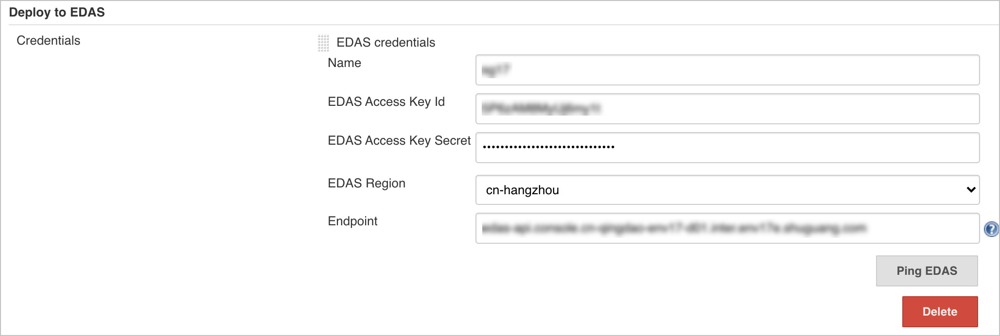
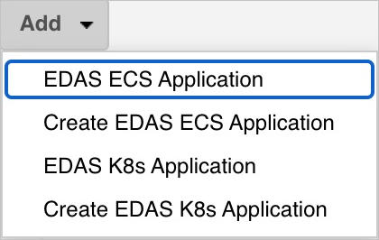
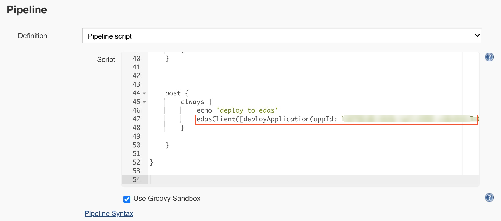
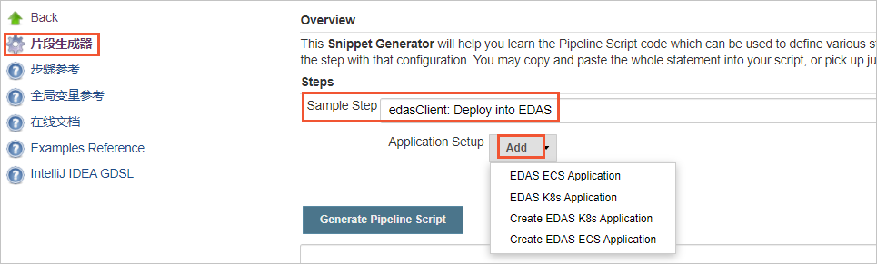

# Alibabacloud EDAS Publisher plugin
This plugin used to publish to Alibabacloud [EDAS](https://www.aliyun.com/product/edas?spm=5176.12825654.h2v3icoap.479.e9392c4afgWdXy) Application as a Post Build step.

# Usage
Alibabacloud credentials are needed in the System Configuration.

## Configure global credentials
Input Alibabacloud credentials in `Manage jenkins -> Configure System`.



`Ping EDAS` to check after finishing the configuration.

## FreeStyle job usage
`Post-build Actions` and choose `Deploy to EDAS`，and `Add` configuration according to the specific scenario；

 

| Name  |  Description |
| :-----|:----------|
|EDAS ECS Application| publish to EDAS ECS application |
|Create EDAS ECS Application| create and publish to EDAS ECS application |
|EDAS K8s Application| publish to EDAS K8s application |
|Create EDAS K8s Application| create and publish to EDAS K8s application |

## Pipeline usage

The pipeline script can be generated by snippet generator.


## Job-dsl usage
```
job('edas') {    
  publishers { 
    edasClient { 
      deployApplication('', '', '', '', '') 
    }
  }
}
```
The methods supported list below：
```
void deployApplication(
        String namespace,
        String credentialsString,
        String group,
        String appId,
        String targetObject)；

void deployApplication(
        String namespace,
        String credentialsString,
        String group,
        String appId,
        String targetObject,
        String versionLabelFormat,
        String versionDescriptionFormat,
        String batch,
        String batchWaitTime,
        String releaseType)；

void insertApplication(
        String namespace,
        String credentialsString,
        String applicationName,
        String packageType,
        String clusterId,
        String targetObject,
        String ecuInfo)；

void insertApplication(
        String namespace,
        String credentialsString,
        String applicationName,
        String packageType,
        String clusterId,
        String targetObject,
        String ecuInfo,
        String versionLabelFormat,
        String versionDescriptionFormat,
        String buildPackId,
        String healthCheckUrl)；

void deployK8sApplication(
        String namespace,
        String credentialsString,
        String appId,
        String targetObject,
        Boolean image)；

void deployK8sApplication(
        String namespace,
        String credentialsString,
        String appId,
        String targetObject,
        Boolean image,
        String edasContainerVersion,
        String webContainer,
        String jdk,
        String versionLabelFormat,
        String envs,
        String startupCommand,
        String args,
        String cpuLimit,
        String memoryLimit,
        String cpuRequest,
        String memoryRequest,
        String replicas,
        String postStart,
        String preStop,
        String readiness,
        String liveness,
        String updateStrategy)；

void insertK8sApplication(
        String namespace,
        String credentialsString,
        String applicationName,
        String packageType,
        String clusterId,
        String targetObject,
        String k8sNamespace,
        String jdk)；

 void insertK8sApplication(
        String namespace,
        String credentialsString,
        String applicationName,
        String packageType,
        String clusterId,
        String targetObject,
        String k8sNamespace,
        String jdk,
        String descFormat,
        String edasContainerVersion,
        String webContainer,
        String versionLabelFormat,
        String envs,
        String startupCommand,
        String args,
        String cpuLimit,
        String memoryLimit,
        String cpuRequest,
        String memoryRequest,
        String replicas,
        String postStart,
        String preStop,
        String readiness,
        String liveness)；
```
